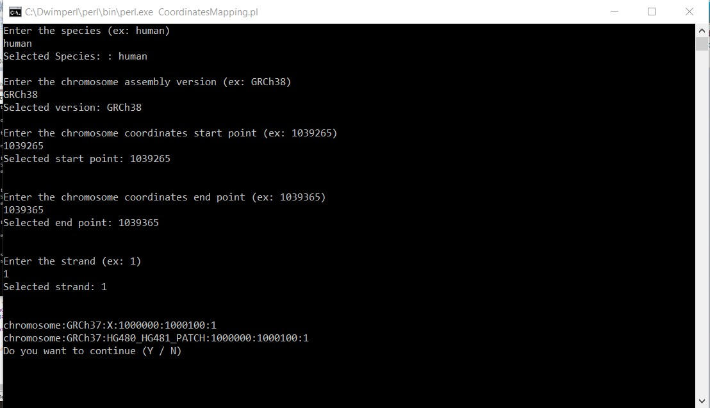

# Chromosome-coordinates-converter-using-Ensembl-Perl-API

The script converts coordinates on chromosome to its matching region in GRCh37 using the human data from Ensembl
and the Perl API

### Steps
##### The user is asked to enter the species
##### The user is asked to enter the chromosome version that he wants to convert to GRCh37
##### The user is asked to enter the region start (needs to be numeric)
##### The user is asked to enter the region end (needs to be numeric)
##### The user is asked to enter the strand (needs to be numeric)
##### If all the entries are correct, the corresponding region boundaries will be shown at the screen
##### Whether the calculation succeed or failed, the user is asked if he wants to do additional calculation with (Y/N) answers
###### If he entered Y, The application will start over from the first step
###### If he entered anything else, the answer will be considered No and the application will exit

## Screenshot

